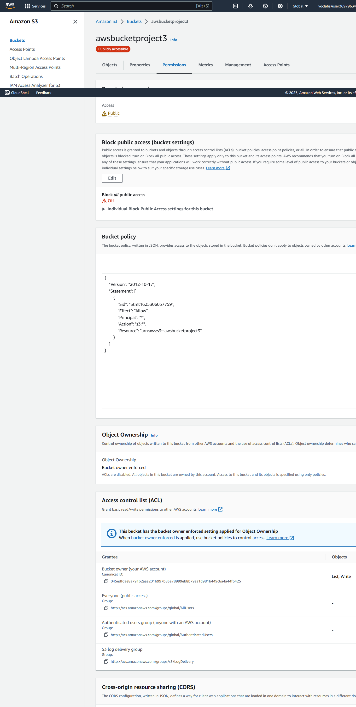
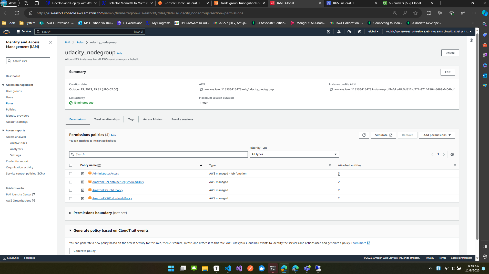
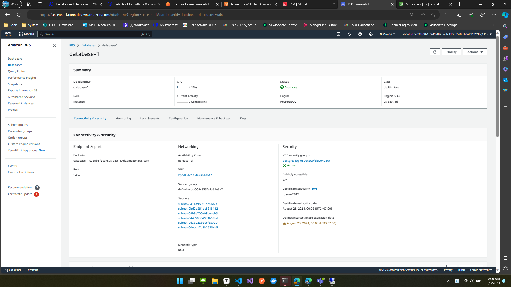

# Project 3

## Create resource AWS

###  S3 


- Bucket policy

```json

{
    "Version": "2012-10-17",
    "Statement": [
        {
            "Sid": "Stmt1625306057759",
            "Effect": "Allow",
            "Principal": "*",
            "Action": "s3:*",
            "Resource": "arn:aws:s3:::awsbucketproject3"
        }
    ]
}
```
- Cross-origin resource sharing (CORS)
```json
[
    {
        "AllowedHeaders": [
            "*"
        ],
        "AllowedMethods": [
            "POST",
            "GET",
            "PUT",
            "DELETE",
            "HEAD"
        ],
        "AllowedOrigins": [
            "*"
        ],
        "ExposeHeaders": []
    }
]
```
### Cluster
- IAM cluster role `eksrole`


- Create cluster


- Result


### Node Group

- Create node Group
- create role first `udacity_nodegrop`
- `udacity_nodegrop` cluster role



- create node group


Note: config như này không dễ bị lỗi 403


###  postgres db

version < 13.7

- create rds


- result




## Source code

- Link Github: [nhonvo/project3 (github.com)](https://github.com/nhonvo/project3)

- Remember credential and session.


### Step 1: build source in local

- udagram-api-feed
- udagram-api-user
- udagram-frontend
- udagram-reverseproxy

`npm install -f`

### Step 2: Docker

- build docker image 

```
docker-compose -f docker-compose-build.yaml build --parallel
```

- smoke test in local(optional)

- Login docker at local `docker login`
- Push images to docker hubs
   -  `docker tag username/image:tag`
   - `docker push username/image:tag` `

- 